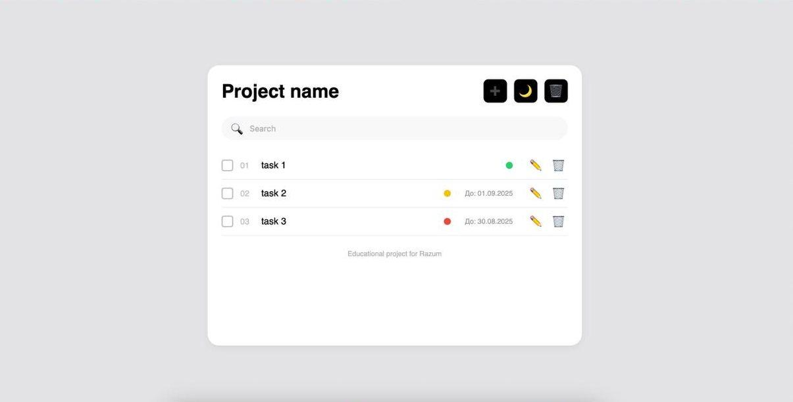
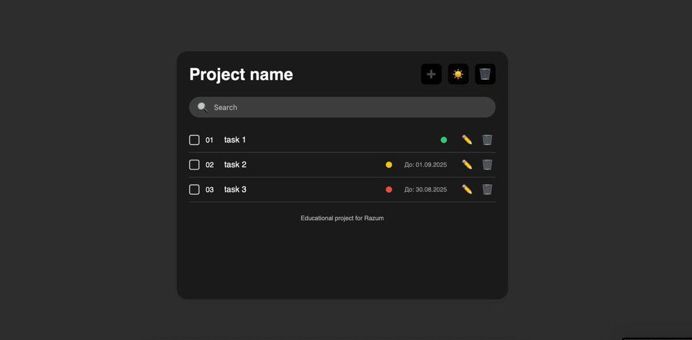

# 📝 To-Do List Application

A modern, responsive To-Do List web application with filters, themes, and local storage.

**Live Demo:** https://razum-dev.github.io/todo-app/

## 🎨 Design & Screenshots

**Figma Mockup:** [Link to Figma design](https://www.figma.com/design/MlfyJsHZR1sfqWU9UMG9HY/Untitled?node-id=0-1&p=f&t=inj92E6EqLye5Bi2-0)

| Light Theme | Dark Theme |
|------------|------------|
|  |  |
| *Clean light theme interface* | *Elegant dark theme for comfortable work* |

**Design features:**
- Modern glassmorphism design
- Smooth animations and transitions
- Fully responsive interface
- Intuitive navigation
- Color-coded priority system

## ✨ Features

- ✅ Add, edit, delete tasks
- 🎯 Priority system (low, medium, high) with automatic deadlines
- 🎨 Light/dark theme toggle
- 🔍 Real-time search and filtering
- 💾 Local storage (data persists after reload)
- 📱 Fully responsive design
- ✏️ Editable project title
- ⏰ Visual deadline indicators

## 🛠️ Built With

- **HTML5** - Semantic markup
- **CSS3** - Flexbox/Grid, animations, responsive design
- **Vanilla JavaScript** - ES6+ features
- **LocalStorage API** - Client-side data persistence

## 🚀 Getting Started

### Prerequisites
No dependencies needed! Just a modern web browser.

### Installation
1. Clone the repository:

git clone https://github.com/razum-dev/todo-app.git

2. Open `index.html` in your browser

### Usage
- **Double-click** project title to edit
- **Click + button** to add new task
- **Use priority dropdown** to set importance
- **Toggle checkbox** to mark tasks complete
- **Use search** to filter tasks
- **Click theme button** to switch light/dark mode

## 📦 Project Structure

todo-app/
├── index.html          # Main HTML file
├── style.css           # Responsive styles and animations
├── script.js           # Application logic and functionality
├── screenshots/        # Application screenshots
└── README.md           # Project documentation

## 🌟 Technical Highlights

- **Modular JavaScript architecture**
- **Clean, maintainable code** with comments
- **Mobile-first responsive design**
- **Accessibility considerations** (keyboard navigation, ARIA)
- **Cross-browser compatibility**

## 🔧 Browser Support

- Chrome 90+
- Firefox 88+
- Safari 14+
- Edge 90+

---

# 📝 To-Do List приложение

Современное адаптивное веб-приложение для управления задачами с фильтрами, темами и локальным хранилищем.

**Живая демо:** https://razum-dev.github.io/todo-app/

## 🎨 Дизайн и скриншоты

**Figma макет:** [Ссылка на макет в Figma](https://www.figma.com/design/MlfyJsHZR1sfqWU9UMG9HY/Untitled?node-id=0-1&p=f&t=inj92E6EqLye5Bi2-0)

| Светлая тема | Тёмная тема |
|------------|------------|
|  |  |
| *Чистый интерфейс в светлой теме* | *Элегантная темная тема для комфортной работы* |

**Особенности дизайна:**
- Современный стекломорфизм (glassmorphism)
- Плавные анимации и переходы
- Полностью адаптивный интерфейс
- Интуитивная навигация
- Цветовая система приоритетов

## ✨ Возможности

- ✅ Добавление, редактирование, удаление задач
- 🎯 Система приоритетов с автоматическими дедлайнами
- 🎨 Переключение светлой/тёмной темы
- 🔍 Поиск и фильтрация в реальном времени
- 💾 Локальное хранилище (данные сохраняются)
- 📱 Полностью адаптивный дизайн
- ✏️ Редактируемый заголовок проекта
- ⏰ Визуальные индикаторы дедлайнов

## 🛠️ Технологии

- **HTML5** - Семантическая верстка
- **CSS3** - Flexbox/Grid, анимации, адаптивный дизайн
- **Vanilla JavaScript** - ES6+ возможности
- **LocalStorage API** - Клиентское хранение данных

## 🚀 Запуск

### Установка
1. Клонируйте репозиторий:

git clone https://github.com/razum-dev/todo-app.git

2. Откройте `index.html` в браузере

### Использование
- **Двойной клик** по заголовку для редактирования
- **Кнопка +** для добавления задач
- **Выбор приоритета** для установки важности
- **Чекбокс** для отметки выполнения
- **Поиск** для фильтрации задач
- **Кнопка темы** для переключения режима

## 📦 Структура проекта

todo-app/
├── index.html          # Главный HTML файл
├── style.css           # Адаптивные стили и анимации
├── script.js           # Логика приложения
├── screenshots/        # Скриншоты приложения
└── README.md           # Документация проекта

## 🌟 Особенности реализации

- **Модульная JavaScript архитектура**
- **Чистый поддерживаемый код** с комментариями
- **Mobile-first адаптивный дизайн**
- **Доступность** (навигация с клавиатуры, ARIA)
- **Кроссбраузерная совместимость**

## 🔧 Поддержка браузеров

- Chrome 90+
- Firefox 88+
- Safari 14+
- Edge 90+
